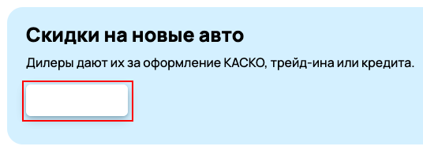
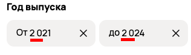
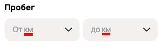
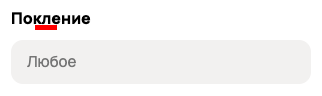
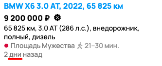
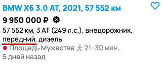
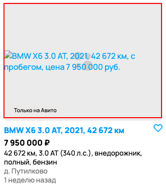
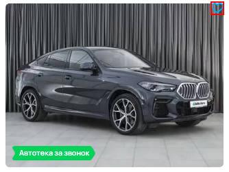
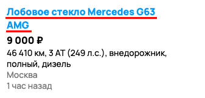
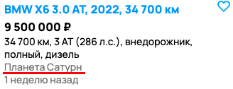

## Баги на странице со скриншота (Задание 1)
## qa-trainee-assignment-autmumn-2024 

|№ бага| 1                                                       |
|-|---------------------------------------------------------|
|Заголовок| Лишний минус перед количеством объявлений               |
|Приоритет|  |
|Изображение|                             |

|№ бага| 2                                                           |
|-|-------------------------------------------------------------|
|Заголовок| Отсуствует текст "Купить" на кнопке                         |
|Приоритет|  |
|Изображение|                                 |

|№ бага|3|
|-|--------|
|Заголовок|Формат даты не корректный|
|Приоритет||
|Изображение||

|№ бага|4|
|-|--------|
|Заголовок|Подсказка величин должна появляться при нажатии на input формы|
|Приоритет||
|Изображение||

|№ бага|5|
|-|--------|
|Заголовок|Орфографическая ошибка в слове "Поколение"|
|Приоритет||
|Изображение||

|№ бага| 6                                                              |
|-|----------------------------------------------------------------|
|Заголовок| При установленном фильтре с 2021 года, в выдачу попал 2019 год |
|Приоритет|          |
|Изображение|                                    |

|№ бага|7|
|-|--------|
|Заголовок|На центральном объявлении бейдж "соответствует оценке" попал в div-блок с названием объявления|
|Приоритет|  |
|Изображение||

|№ бага|8|
|-|--------|
|Заголовок|Лексическая ошибка во фразе "2 дни назад"|
|Приоритет||
|Изображение||

|№ бага|9|
|-|--------|
|Заголовок|При установленном фильтре "Полный привод" в выдачу попал "передний", кроме этого, у BMW в этом поколении вообще такого привода не существует|
|Приоритет||
|Изображение||

|№ бага|10|
|-|--------|
|Заголовок|С сервера не загружается изображение обявления|
|Приоритет|  |
|Изображение||

|№ бага|11|
|-|--------|
|Заголовок|Иконка "избранное" попала в другой div-блок|
|Приоритет||
|Изображение||

|№ бага|12|
|-|--------|
|Заголовок|Title карточки товара совсем другой модели из категории "Авто". Не совпадает модель, год.|
|Приоритет||
|Изображение||

|№ бага|13|
|-|--------|
|Заголовок|Title карточки товара из другой категории "Автозапчасти" (и другой модели).|
|Приоритет||
|Изображение||

|№ бага|14|
|-|--------|
|Заголовок|Несуществующий адрес в карточке (планета Сатурн)|
|Приоритет||
|Изображение||

|№ бага| 15                                                                          |
|-|-----------------------------------------------------------------------------|
|Заголовок| Выбранный чек-бокс после примененной фильтрации должен был перенесен наверх |
|Приоритет|                      |
|Изображение|                                                |